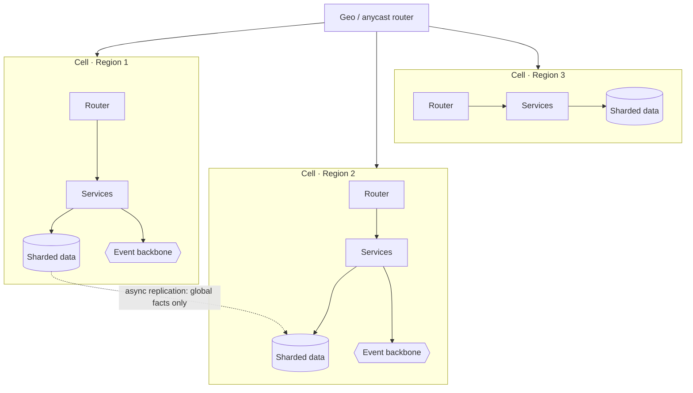

# Pattern · Multi-Region Cells

The **T4 move**. Past ~100k users the question stops being "can it handle the load" and becomes
"how much breaks when something fails, and how far away are my users." Cells answer both by making
the **failure domain** and the **latency domain** small and independent.

---

## What a cell is

A **cell** is a complete, self-contained stack — router, services, data, cache, event bus — serving
a slice of traffic, with **no runtime dependency on any other cell**.



Cells map to regions (for latency + disaster isolation) and often subdivide further (cells *within*
a region to shrink blast radius below "the whole region").

---

## Two reasons to do it

1. **Blast radius (resilience):** a bug, bad deploy, or outage hits **one cell**, not everyone.
   Routing withdraws the dead cell; the rest serve normally.
2. **Latency (geography):** users hit the **nearest** cell. Physics — a packet to the other side of
   the planet costs ~150 ms round-trip no caching can fix.

---

## The central T4 decision: global vs cell-local

This is the hard part. Most data should be **cell-local** (cheap, fast, independent). A few facts
are irreducibly **global** and need cross-cell coordination:

| Cell-local (the default) | Global (the exception) |
|---|---|
| [game fleets, matches](../01-games/fleet-orchestration.md) | player **identity** |
| [regional catalog, inventory](../05-marketplace/architecture.md) | **payment ledger** / money |
| [regional leaderboards](../01-games/leaderboards-and-meta.md) | global **uniqueness** (usernames) |
| [feeds, timelines](../03-social-feed/architecture.md) | **global leaderboard = roll-up** of regional |
| [chat channels](../04-realtime-chat/architecture.md) | cross-region DR replicas |

**Rule:** keep the global set as small as you possibly can. Every globally-consistent fact costs
cross-region latency and coordination. Identity and money usually make the list; almost nothing
else should.

---

## Consistency across cells

- **Within a cell:** per-shard strong consistency, as at [T3](sharding-partitioning.md).
- **Across cells:** **async replication → eventual** for the global facts. You replicate the
  identity store and payment ledger between regions and accept replication lag; you do *not* try to
  run a globally-synchronous database.
- **Routing affinity:** pin a user/tenant to a **home cell** so their data is local and consistent;
  cross-cell access is the rare, slow path.

---

## Failover & DR

```mermaid
sequenceDiagram
    participant GEO as Geo router
    participant A as Cell A (healthy)
    participant B as Cell B (failing)
    GEO->>B: health check
    B-->>GEO: failing
    GEO->>GEO: withdraw Cell B from routing
    GEO->>A: shift B's traffic (to nearest healthy)
    Note over A,B: B's users served from replica;<br/>rehearsed via chaos/DR drills
```

- **Rehearse failover** — a DR plan never tested is a DR plan that doesn't work. Run
  [chaos drills](failure-and-resilience.md) that kill a cell on purpose.
- **Progressive rollout per cell:** deploy to one cell, watch its
  [SLOs](observability-slos.md), then proceed — a bad release is contained to one cell.

---

## Cost governance

At this scale, capacity is money. Govern on **cost per unit of real load** — cost per CCU
([games](../01-games/scaling-tiers.md)), per active user, per order — not absolute spend. Idle
[warm buffers](../01-games/fleet-orchestration.md), over-replicated data, and cross-region traffic
are the usual budget leaks.

---

## Per-tier (see [spine](../00-scaling-spine.md))

- **T0–T3:** single region (multi-AZ at T3). **Do not** go multi-region early — it's a large,
  permanent complexity tax.
- **T4:** multi-region cells; geo routing; global set minimized; DR rehearsed; cost-per-load
  governed.

**Capacity metric:** **per-cell capacity × cell count**, bounded by **cross-region replication lag**
for the global facts.
