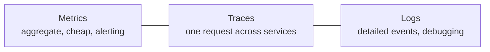
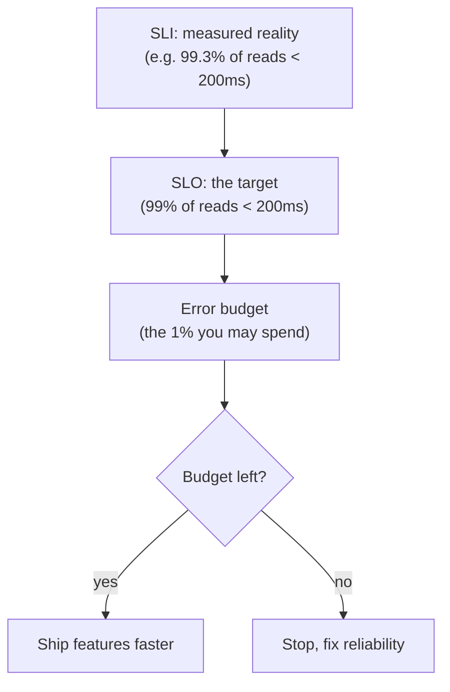

# Pattern · Observability & SLOs

You cannot scale what you cannot see. Observability **precedes** every architecture move in this
playbook — you instrument, watch the metric that drives the next bottleneck, and move when it says
so, not on a hunch.

---

## The three signals

- **Metrics** — numeric time series; what you alert on. Cheap, aggregate.
- **Traces** — a single request stitched across services; how you find *where* latency/errors live
  once you're past a monolith ([T3+](../00-scaling-spine.md)).
- **Logs** — structured (never `printf`), with IDs (`request_id`, `tenant_id`,
  [`match_id`](../01-games/architecture.md)) so they correlate to traces.

---

## What to measure: RED & USE

- **RED (per service / request flow):** **R**ate (req/s), **E**rrors (%), **D**uration (latency
  distribution). The view for request-driven services.
- **USE (per resource):** **U**tilization, **S**aturation, **E**rrors. The view for a constrained
  resource — CPU, connection pool, [queue depth](queues-and-eventing.md),
  [warm buffer](../01-games/fleet-orchestration.md).

Always look at **percentiles, not averages** — p99 latency is the user experience that hurts; the
mean hides it.

---

## SLIs, SLOs, error budgets

- **SLI** — the actual measured number.
- **SLO** — the promise (e.g. "99% of matches start in < 10 s").
- **Error budget** — `1 − SLO`. Spend it on velocity; when it's exhausted, reliability work
  preempts features. This turns "is it reliable enough?" into a number instead of an argument.

### The capacity SLO for each archetype
Tie an SLO to the **capacity metric** the [three questions](../00-scaling-spine.md) identified:
- [Games](../01-games/scaling-tiers.md): **time-to-match**, **p99 tick time**, **allocation
  latency**, **warm-buffer health**.
- [SaaS](../02-saas/architecture.md): **read latency**, **cache hit rate**, **replica lag**.
- [Social](../03-social-feed/architecture.md): **feed read latency**, **fan-out lag**.
- [Chat](../04-realtime-chat/architecture.md): **delivery latency**, **connection count headroom**.
- [Marketplace](../05-marketplace/architecture.md): **checkout success rate**, **hot-row latency**.

---

## Alerting

- **Alert on symptoms (SLO burn), not causes.** "Error budget burning fast" > "CPU at 80%." High
  CPU may be fine; users seeing errors is not.
- **Page on user-facing SLO violations**; ticket everything else. Pager fatigue kills response.

---

## Per-tier (see [spine](../00-scaling-spine.md))

- **T0–T1:** logs + an uptime check.
- **T2:** metrics + structured logs; RED dashboards per service.
- **T3:** distributed tracing; SLOs + error budgets; symptom-based alerting.
- **T4:** SLOs **per [cell](multi-region-cells.md)**; per-region error budgets; cross-region
  health for routing decisions.

**Capacity metric:** this *is* the card about finding and watching the capacity metric — everywhere
else points here.
