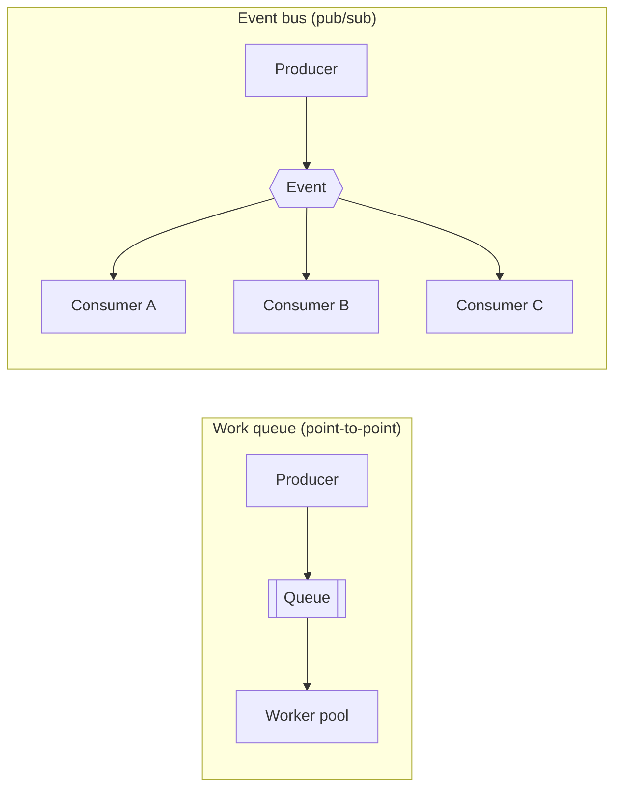
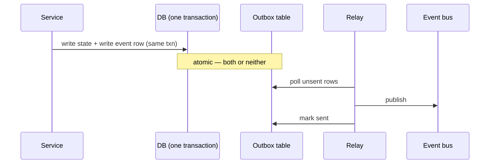

# Pattern · Queues & Eventing

Decouple producers from consumers in time. Anything the user doesn't need *in the response* goes on
a queue; anything other services need to *know about* becomes an event. This is how the slow path
stops blocking the fast path and how services stop calling each other synchronously.

---

## Queue vs event bus

- **Work queue:** one logical consumer does the job once (send email, transcode video,
  [fan-out a post](../03-social-feed/architecture.md)). Scale by adding workers.
- **Event bus:** one fact, many independent reactions. A
  [match result](../01-games/leaderboards-and-meta.md) → progression *and* inventory *and*
  leaderboard *and* telemetry, each a separate consumer added without touching the producer.

---

## Delivery semantics — embrace at-least-once

Exactly-once delivery is largely a myth across a network. The practical contract is **at-least-once
delivery + idempotent consumers = effectively-once processing.**

- **Idempotency key** on every message; the consumer records processed keys and ignores duplicates.
  This is the same key that prevents [double-charges](../05-marketplace/architecture.md) and
  [double leaderboard credits](../01-games/leaderboards-and-meta.md).
- **Dead-letter queue (DLQ):** messages that keep failing move aside for inspection instead of
  blocking the queue forever.
- **Retries with backoff + jitter** ([resilience](failure-and-resilience.md)) — never tight-loop a
  failing message.

---

## The outbox pattern (don't lose events)

The classic bug: write to the DB, then publish an event — and crash in between. Now the DB and the
event stream disagree. The fix:

Write the **business change and the outgoing event in the same transaction** (the event lands in an
outbox table); a relay publishes from the outbox afterward. State and events can never diverge.
This underpins [marketplace sagas](../05-marketplace/architecture.md).

---

## Backpressure & ordering

- **Backpressure:** when consumers fall behind, the queue *is* the buffer — but a growing backlog
  is a signal; autoscale workers on **queue depth**, and shed load upstream if it can't keep up
  ([resilience](failure-and-resilience.md)).
- **Ordering:** global ordering is expensive. Order **per partition key** (per channel, per author)
  via partitioned topics — same idea as [sharding](sharding-partitioning.md). Don't promise global
  order you don't need.

---

## Streaming / telemetry firehose

High-volume events ([game telemetry](../01-games/architecture.md), clickstreams) → a streaming log
→ a warehouse. Distinct from work queues: consumers read at their own pace from a retained,
replayable log, enabling reprocessing and analytics without touching the OLTP path.

---

## Per-tier (see [spine](../00-scaling-spine.md))

- **T1:** one background worker for the slow path.
- **T2:** a real queue + worker pool; idempotent consumers.
- **T3:** an **event bus** decouples services; outbox guarantees no lost events.
- **T4:** per-region [event backbones](multi-region-cells.md) with async cross-region replication
  for the few global facts.

**Capacity metric:** **queue depth / consumer lag** — the early-warning signal for the whole async
tier.
