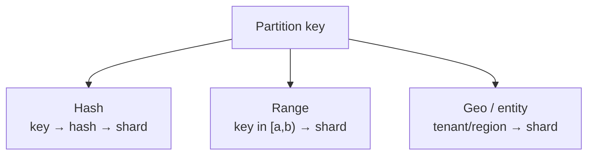
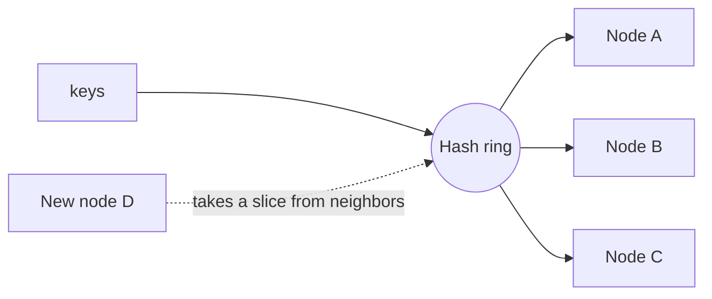

# Pattern · Sharding & Partitioning

Split one dataset across many stores so write/storage load no longer fits on a single primary. This
is the **T3 wall-breaker** — and the move that costs you joins, cross-shard transactions, and
operational simplicity. Earn it; don't reach for it early.

---

## Partitioning strategies

| Strategy | Spreads load | Range scans | Hotspot risk | Good for |
|---|---|---|---|---|
| **Hash** | evenly | bad (scattered) | low | point lookups by key (users, sessions) |
| **Range** | unevenly | good | high (sequential keys) | time series, ordered scans |
| **Geo / entity** | by entity | within entity | per-entity | [tenants](../02-saas/architecture.md), [regions](multi-region-cells.md) |

**Choosing the key is the whole game.** A good key spreads writes evenly *and* keeps related data
co-located so most queries hit one shard. Examples in this playbook:
- [SaaS](../02-saas/architecture.md): shard by **tenant** — load spreads, a tenant's data stays together.
- [Social](../03-social-feed/architecture.md): posts by **author**, graph by **user**.
- [Chat](../04-realtime-chat/architecture.md): messages by **channel**.

---

## The costs you take on

- **No cross-shard joins/transactions:** queries spanning shards must scatter-gather in the app, or
  move to a [warehouse](queues-and-eventing.md) fed by events. Per-shard you keep strong
  consistency; across shards you get eventual.
- **Cross-shard fan-out reads** get slower with shard count — design queries to hit one shard.
- **Resharding is painful** — see below.

---

## Hot keys / hot shards

Even good keys get hotspots: a celebrity author, a flash-sale SKU, a mega-channel.

- **Sub-key splitting:** split the one hot key into K sub-keys (e.g. sharded counters for
  [inventory](../05-marketplace/architecture.md)), reads sum across them.
- **Dedicated handling:** pull hot entities out of the normal path (celebrity
  [pull-on-read](../03-social-feed/architecture.md), hot-channel broadcast).
- **Cache the hot key hard** ([caching](caching.md)) — often immutable data (posts) caches trivially.

---

## Resharding without downtime

Adding shards must not require moving everything. Two common approaches:

- **Consistent hashing** — keys map onto a ring; adding a node moves only its neighbors' keys, not
  the whole dataset. (This is exactly what a load balancer does for backends — see
  [load-balancing](load-balancing.md) and project 05 in this repo.)
- **Logical shards over physical nodes** — many small logical shards mapped onto fewer machines;
  rebalancing moves whole logical shards, never individual keys.

---

## Per-tier (see [spine](../00-scaling-spine.md))

- **T0–T2:** **don't shard.** One primary + read replicas. Sharding here is premature.
- **T3:** shard the primary when vertical scaling + replicas can't absorb writes. Pick the key
  carefully — it's hard to change.
- **T4:** partition by **geo/tenant** so shards align with [cells](multi-region-cells.md); most
  data stays cell-local.

**Capacity metric:** **write throughput per shard** and **cross-shard fan-out** of your common
queries.
